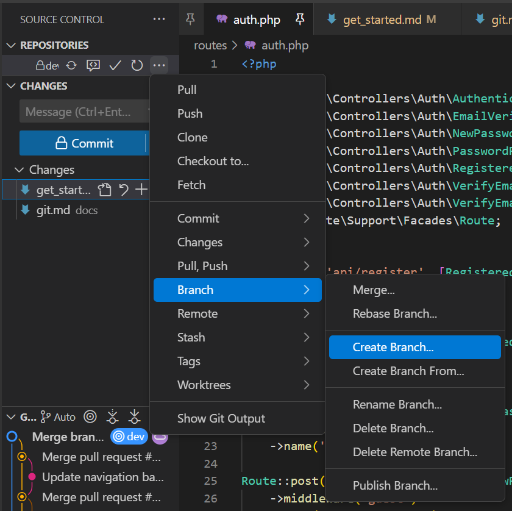
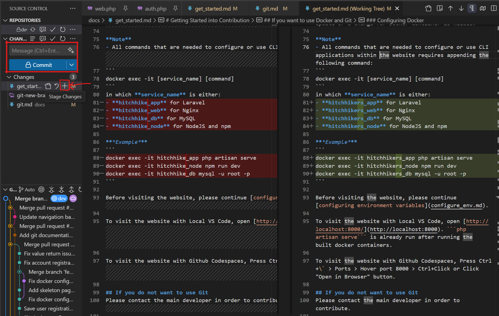
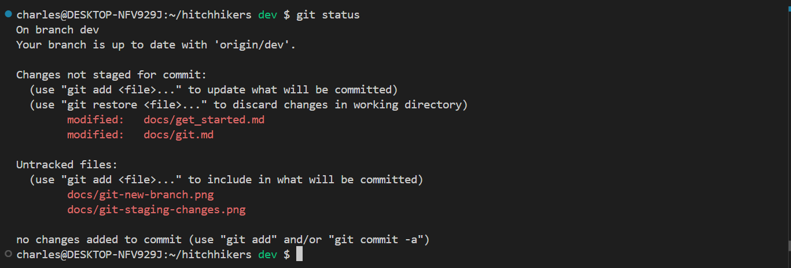
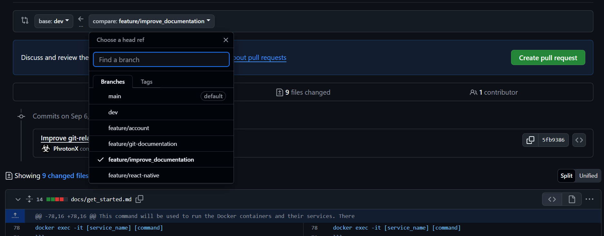
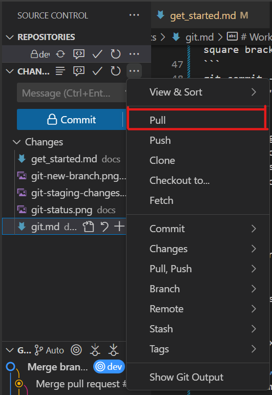
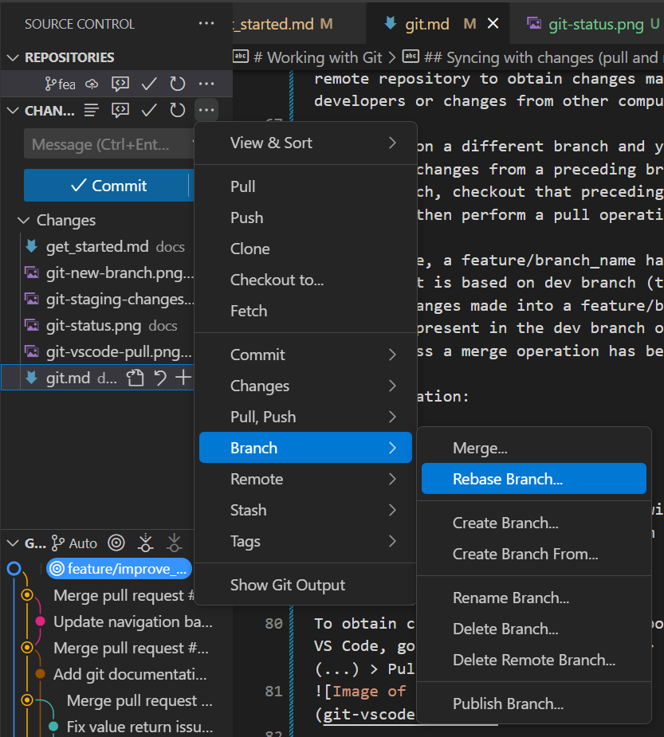
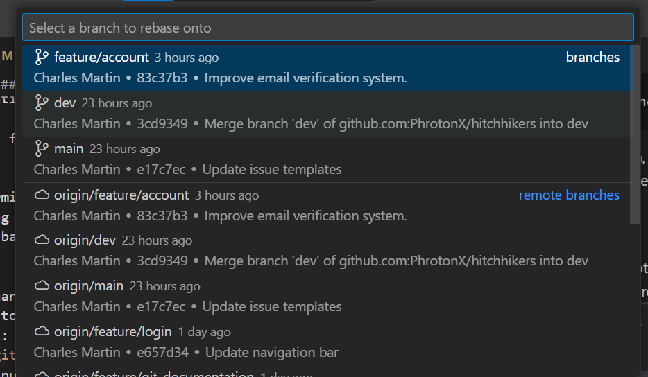

# Working with Git

**Note:** You can use the Source Control tab on VS Code in place of commands.

## To switch branches

## To contribute for a feature
Make sure that you are switched to a dev branch by performing the following command on the terminal:
```
git checkout dev
```

Create a branch for each feature. To create a branch based on the currently checked-out branch, perform the following command:
```
git checkout -b feature/branch_name.
```
or on VS Code, open the Source Control Panel > More Actions (...) > Branch > Create Branch:



You are supposed to create a branch for each feature (e.g. login frontend, login backend, fix for login, etc.) that is based on dev branch.

## Making a commit and pushing changes
Each feature, a fix, or a code change must be staged before making a commit.

### VS Code
To stage a file, Open the Source Control Panel and press the add (+) button on desired files or lines of code. The left and right pane displays the previous and current state of code on a file.


After staging files, write a commit message explaining the staged changes and then press commit. After making one or more commits, press either "Publish Branch" or "Push Changes" button to upload your commits into the remote repository within your branch. A passkey might be prompted before performing a push.

You may always repeat the whole process for each feature, fixes, or changes you make.

### Git Terminal
To stage a file, type the following command to see if changes on files can be staged:
```
git status
```



Then use the following command to stage unstaged files:
```
git add [filename]
```
or to add all files:
```
git add --all
```

After staging your files, perform the following command to make a commit. The command within square brackets or [] is optional.
```
git commit -m "Commit title" [-m "Commit description"]
```

After making one or more commits, perform the following command to push your changes into the remote repository within your branch. A passkey might be prompted before performing a push.

```
git push
```
If your branch is not yet uploaded to the remote repository, perform the following command instead:
```
git push --set-upstream origin branch_name
```

You may always repeat the whole process for each feature, fixes, or changes you make.

## Merging changes into target branch
### To merge changes on merge-protected branches
Branches such as main, release/*, and dev branches are merge-protected to avoid unwanted and unreviewed changes.

If you wanted your changes to be visible on merge-protected branches, [open the repository](https://github.com/PhrotonX/hitchhikers/) > Pull requests > New pull request.

Do not forget to choose your base branch (typically dev) and then on compare button, choose the succeeding branch or the branch you wanted to merge onto base branch.



## Syncing with changes (pull and rebase)
It is recommended to always pull changes from the remote repository to obtain changes made by other developers or changes from other computers.

If you are on a different branch and you want to bring some changes from a preceding branch or a target branch, checkout that preceding/target branch and then perform a pull operation.

For instance, a feature/branch_name has been created that is based on dev branch (target branch). Changes made into a feature/branch_name may not be present in the dev branch or its target branch unless a merge operation has been occured.

For illustration:
```
main < dev < feature/branch_name
```

Another illustration:
```
main < dev < feature/branch_name < feature/prototype_b

main < dev < feature/branch_name < feature/prototype_a
```

After performing a pull operation, switch back to the suceeding branch and then perform a rebase towards the base branch.

It is a recommended practice to always perform pull and rebase operations for each time before you work for new changes, work on a new branch, or continue working for new changes. You may review the changes on a target branch after pulling changes and before performing a rebase.

<!-- It is also possible to cause a git conflict when rebasing two incompatible changes. -->

Below are the steps needed to perform the aforementioned operations for both VS Code and git terminal:
### VS Code
To obtain changes from the remote repository using VS Code, go to Source Control Panel > More Actions (...) > Pull:


To perform a rebase, make sure that you are on the suceeding branch of a target branch. To perform this, open Source Control Panel > More Actions (...) > Rebase Branch > Select the preceding/targer or updated branch (e.g. dev branch)




### Git Terminal
To obtain changes from the remote repository, perform the following command:
```
git pull
```

before performing a rebase, make sure that you are on the suceeding branch of a target branch.
To perform a rebase, perform the following command:
```
git rebase target_branch_or_preceding_branch
```